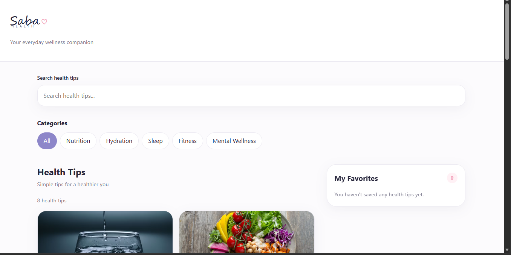

# Saba Health

Saba Health is a responsive wellness information web app designed to help users discover and save simple everyday health and wellness tips. It is built with HTML, CSS, and vanilla JavaScript, and loads health tips from a local JSON file.

## Features

- Load health tips from a local JSON file
- Render tips dynamically with JavaScript
- Search tips by title or summary
- Filter tips by category
- Save/remove favorite tips
- Persist favorites using `localStorage`
- Responsive mobile-first layout
- Semantic, accessible HTML
- Loading, error, and empty states
- Subscription form with validation (name and email)
- Tip detail modal for viewing full content

## Tech Stack

- HTML5
- CSS3 (custom properties, Flexbox, Grid, media queries)
- JavaScript (ES6+)
- No external libraries

## How to Run

1. Clone this repository:  
   `git clone https://github.com/LidiaAlemu/CodeOps_Portfolio.git`
2. Open `Module2` folder
3. Find `Saba Health` folder
4. Open `index.html` in a web browser.  
   

## Screenshots

## Project Structure

Plan/plan.md
index.html
styles.css
app.js
data/health.json
README.md

## Disclaimer

Saba Health provides general wellness information and is not a substitute for professional medical advice.